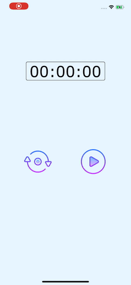
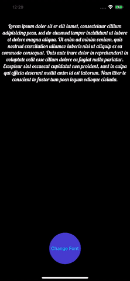
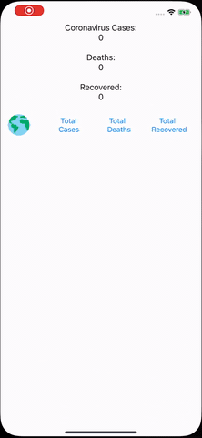

# 30DaysofSwift
A collection of awesome swift projects

Hello, I'm Asif and I'm an iOS application developer. Recently I noticed some posts about 100 / 30 days of swift projects on medium and github. So I told myself why not give a try. So here goes my 30 days :). Enjoy.

## Day 1 - [Stopwatch](Day1-StopWatch/Day1-StopWatch)
> What is needed to learn:
* how to use Timer

## Day 2 - [CustomFont](Day2-CustomFont/Day-2-CustomFont)
> What is needed to learn:
* how to add fonts in project

## Day 3 - [Corona Update](CoronaUpdate)
> What is needed to learn:
* How to make Network request
* how to manage model
* how to handle reachability
* how to add Refresh control
__*caution: not a beginner project*__

